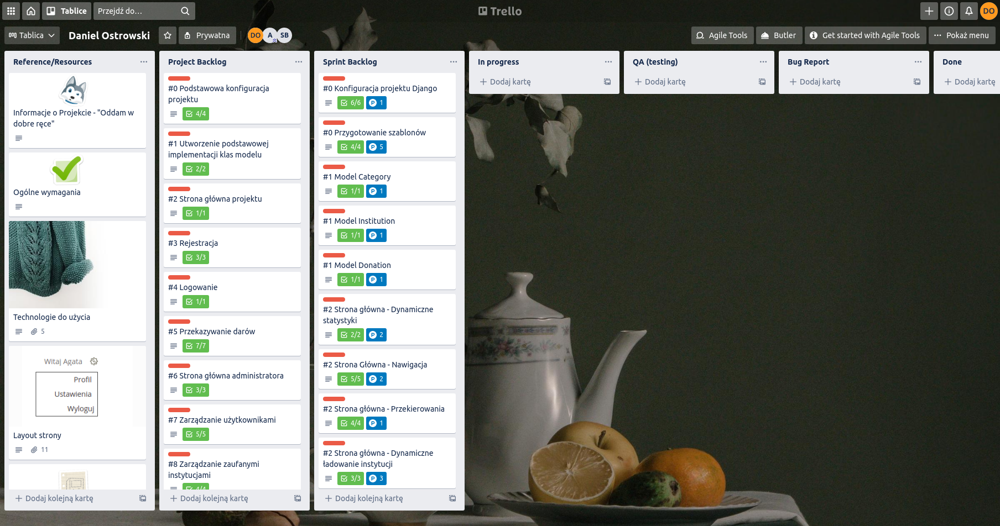

# Good hands

I did this project after completing the course as per the instructions from Trello.

## Description

The purpose of the project is to create a place where everyone can donate unnecessary things to trusted institutions.

## Preview

This is raw code. How it works You can find out at:
https://good-hands.herokuapp.com/

## Technologies

* Python
* Django
* PostreSQL
* JavaScript

## Features

* Register / login
* Make donation

#### To do

* Confirm registration in e-mail
* Edit user profile
* Add confirmation for taken bags
* Run contact form
* Add cookies and set django session 
#### (Optional)
* Pagination of institutions
* Static menu bar